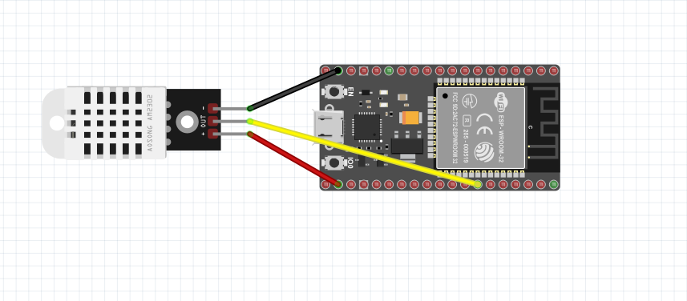

## Overview
This project uses an **ESP32** microcontroller to read **temperature and humidity** data from a **DHT22 (AM2302) sensor** and send the data to a **WebSocket server**. The server then forwards the data to a **webpage**, where real-time temperature and humidity updates are displayed.
The goal is to demonstrate Internet of Things principles by connecting an embedded device to a web-based dashboard.

## Schema
Below is the **schematic of the hardware setup**, created using [Fritzing](https://fritzing.org/)



   | **ESP32 Pin** | **DHT22 Pin** | **Wire Color** |
   |--------------|--------------|---------------|
   | **3.3V**     | **VCC**      | 🔴 Red |
   | **GND**      | **GND**      | ⚫ Black |
   | **GPIO33**   | **Data**     | 🟡 Yellow |
   
---
## Pre-requisites
### **🔹 Hardware Components**
   -  **ESP32 WROOM**
   -  **DHT22 (AM2302) Temperature & Humidity Module Sensor**
   -  **3 Femele to femele jumper Wires**


## **🔹 Software & Libraries**
   - Arduino IDE with **ESP32 Board Package**
   - **DHT sensor library by Adafruit** (`Adafruit_Sensor.h`, `DHT.h`)
   - **WebSocketsClient library** (`WebSocketsClient.h`)
   - **[Node.js](https://nodejs.org/) WebSocket Server**
   - **HTML/JavaScript WebSocket Client**

---
## Setting Up a React Project with Vite
   **Create a New [Vite](https://vite.dev/) Project**
   Open your terminal and run the following command to create a new Vite project
   ```bash
   npm create vite@latest my-react-app --template react
   ```
   Replace my-react-app with your desired project name.
   Navigate to the Project Directory
   ```bash
   cd my-react-app
   ```
   Install Dependencies
   ```bash
   npm instal
   ```
   Start the Client
   ```bash
   npm run dev
   ```
   Your React application should now be running at http://localhost:5173.
   
---   
## Setting Up an [Express.js](https://expressjs.com/) Project
   **Initialize a New Node.js Project**
   ```bash
   mkdir my-express-app
   cd my-express-app
   npm init -y
   ```
   Install Express.js
   ```bash
   npm install express
   ```
   Start the Express Server
   ```bash
   node index.js
   ```
   Your Express application should now be running at http://localhost:3000.


